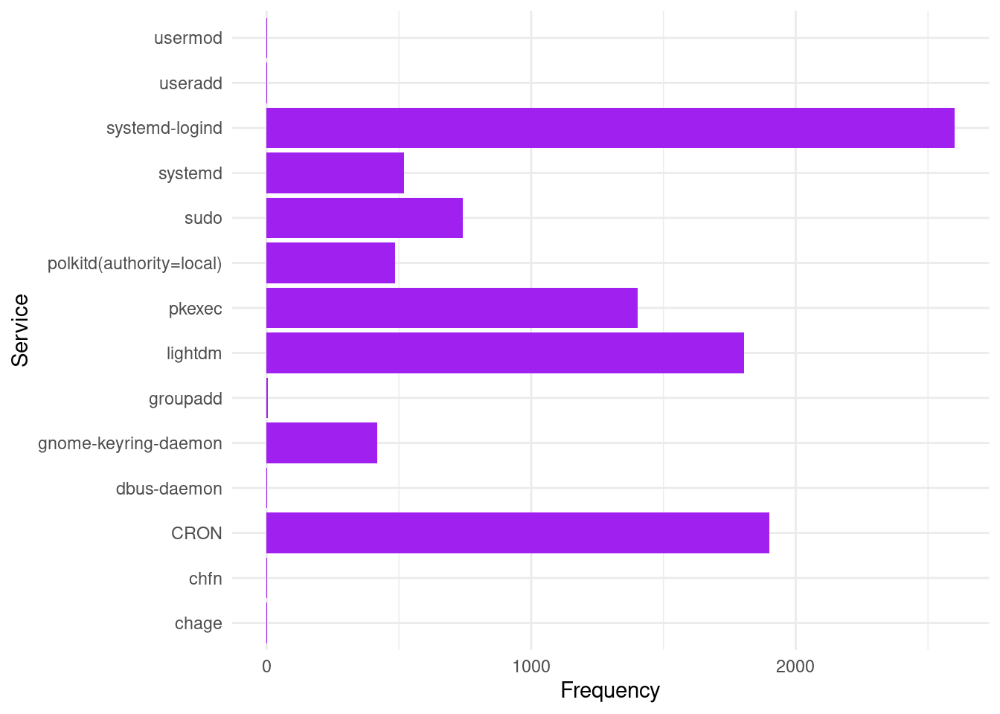

# Projeto de Cibersegurança para análise de logs de autenticação

## Objetivo

Converter dados do arquivo **auth.log**, que armazena eventos relacionados à autenticação em sistemas Linux, em um arquivo CSV pronto para análise e analisar as informações dos logs.

A análise busca extrair insights relevantes sobre a autenticação de serviços no computador alvo.

## Tecnologias

- R (tidyverse, dplyr, kableExtra)
- Python

## Base de dados para extração

A base de dados para extração será uma amostra de 10K linhas do arquivo **auth.log** do Linux Mint que está instalado no meu notebook. A data de extração foi 12/09/2024. Tais dados representam logs de autenticação dos meses de Abril/2024 a Jun/2024.

O arquivo **auth.log** contém todos os eventos relacionados à autenticação em computadores com sistema operacional Linux baseados no Debian ou no Ubuntu. 

Sendo assim, ele é crucial para a segurança de sistemas operacionais Linux,registrando todas as tentativas de autenticação, tanto bem-sucedidas quanto falhas, além de outras atividades relacionadas à segurança, como mudanças de senha e uso de comandos sudo.

## Formato de saída dos dados

| Timestamp | Service | Message |
| --------- | ------- | ------- |
|    2024-01-31 09:15:29       |    lightdm     |  gkr-pam: unable to locate daemon control file       |
|    2024-05-20 13:15:29       |    sudo     |  pam_unix(sudo:session): session opened for user root      |

## Perguntas a serem respondidas pela análise

- Qual a frequência de logs de cada serviço?
- Quantas e quais tentativas de autenticação falharam?
- Quantas sessões de root são abertas em média por dia?
- Quais são os horários de pico de tentativas de login?

## Metodologia

O projeto seguirá as fases do Data Analytics Lifecycle:

1. **Descoberta** (Discovery): esta etapa consiste em aprender sobre o domínio do negócio, analisando o histórico da organização em análise de dados.
2. **Preparação dos dados** (Data Preparation): esta etapa consiste em extrair os dados de um sistema-fonte, converter em um formato que possa ser analisado e armazenar em um armazém ou outro sistema.
3. **Planejamento do modelo** (Model Planning): esta etapa consiste em determinar os modelos e técnicas a serem aplicadas.
4. **Construção do modelo** (Model Building): esta etapa consiste em executar o planejamento da fase anterior em cima de uma base de dados menor e selecionada para a realização de testes e treinamento dos modelos.
5. **Comunicar os resultados** (Communicate Results): esta etapa consiste em identificar os principais resultados, aferindo com o os objetivos de negócio levantados na etapa 1. 
6. **Operacionalizar** (Operationalize): esta etapa consiste nas entregas finais do projeto que podem ser relatórios, algoritmos, instruções e documentos técnicos. 

## Implementação das fases

- **Descoberta** : Nessa etapa foi compreendido o domínio do problema de análise de logs de segurança no Linux. Além disso, foram delimitadas quais perguntas de pesquisa serão respondidas. 
- **Preparação dos dados**: Os dados brutos foram obtidos a partir do comando <code> head -n 10000 /var/log/auth.log > sample_auth_log_10000_Sep_12_24.txt</code>. Em seguida, foi realizada a transformação dessa base de dados em um formato analisável por meio do arquivo <code> log_transformation.py</code>.
- **Planejamento do modelo**: Foram selecionadas as variáveis e métricas que melhor supriam as necessidades de pesquisa.
- **Construção do modelo**: A análise é realizada sobre uma base de dados reduzida. Tal análise é suficiente para responder as questões de negócio.
- **Comunicar os resultados**: A comunicação dos resultados é feita no próprio arquivo que contém código e análise.
- **Operacionalizar**: A análise é exportada em um formato viável para compartilhamento e execução por vários stakeholders.

## Resultados

A análise completa está presente no arquivo <code>.html</code>, que pode ser baixado e executado localmente no navegador. Segue uma pequena parte da análise. Um gráfico que responde a primeira pergunta referente à frequência de logs por serviço. 

